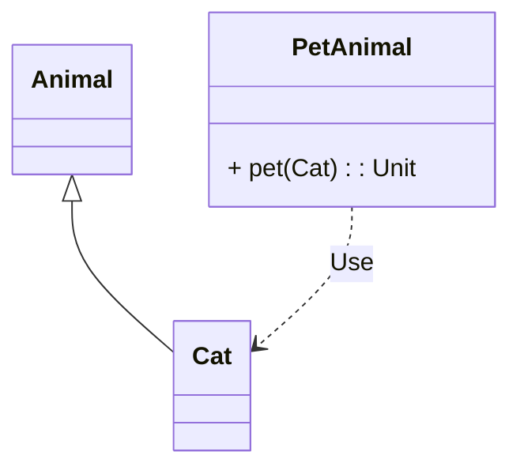
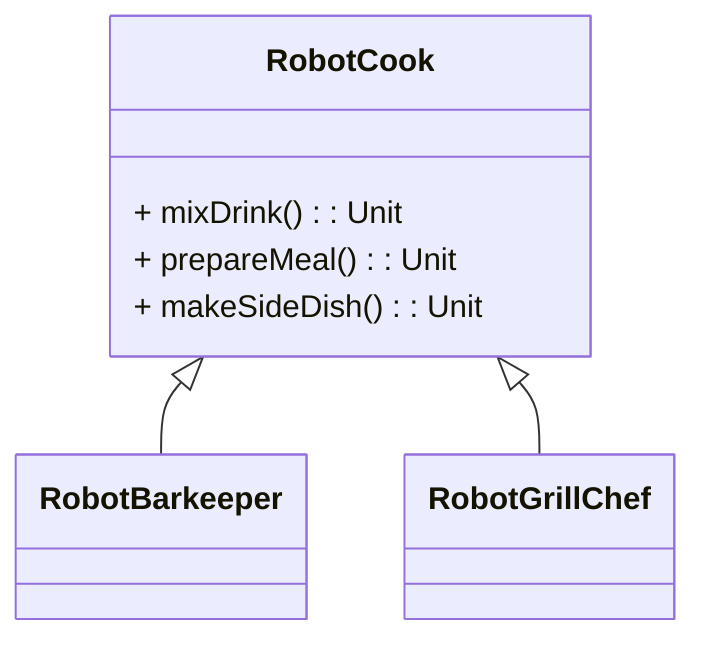

# Thema: SOLID
## Frage 1: Was besagt das Liskov Substitution Principle (LSP)?
- [ ] Subklassen dürfen Methoden der Elternklasse nicht überschreiben.
- [ ] Eine Subklasse darf nur private Attribute haben.
- [ ] Eine Subklasse muss sich in jedem Kontext wie ihre Elternklasse verhalten.
- [ ] Subklassen müssen weniger Methoden als ihre Elternklassen haben.

## Frage 2: Welches Problem kann eine Verletzung des Liskov Substitution Principle (LSP) verursachen?
- [ ] Methoden können nicht überladen werden.
- [ ] Subklassen verhalten sich unerwartet und brechen bestehende Logik.
- [ ] Es können keine neuen Methoden hinzugefügt werden.
- [ ] Der Code wird automatisch langsamer.

## Frage 3: Warum ist es problematisch, wenn eine Klasse Methoden eines Interfaces implementiert, die sie nicht benötigt?
- [ ] Die Klasse wird automatisch größer.
- [ ] Die Klasse wird unnötig abhängig von Methoden, die sie nicht nutzt.
- [ ] Es führt zu weniger Wiederverwendbarkeit.
- [ ] Der Compiler ignoriert ungenutzte Methoden.

## Frage 4: Wie kann das Interface Segregation Principle (ISP) korrekt angewendet werden?
- [ ] Durch die Aufteilung eines großen Interfaces in mehrere spezialisierte Interfaces.
- [ ] Durch die Verwendung eines einzigen Interfaces für alle Klassen.
- [ ] Indem jede Klasse alle Methoden eines Interfaces implementiert.
- [ ] Indem ein Interface nur aus einer einzigen Methode besteht.

## Frage 5: Was ist das Hauptziel des Dependency Inversion Principle (DIP)?
- [ ] Low-Level-Module sollten High-Level-Module steuern.
- [ ] High-Level-Module sollten nicht direkt von Low-Level-Modulen abhängen.
- [ ] Low-Level-Module sollten keine Abstraktionen verwenden.
- [ ] High-Level-Module sollten konkrete Implementierungen direkt referenzieren.

## Frage 6: Wie kann man das Dependency Inversion Principle (DIP) umsetzen?
- [ ] Alle Klassen sollten konkrete Implementierungen als Abhängigkeiten nutzen.
- [ ] High-Level-Module sollten sich direkt auf Low-Level-Module beziehen.
- [ ] Abstraktionen (Interfaces) definieren, die von beiden Modulen genutzt werden.
- [ ] Low-Level-Module sollten High-Level-Module steuern.

## Frage 7: Was ist ein Vorteil der Anwendung des Dependency Inversion Principle (DIP)?
- [ ] Der Code wird kürzer.
- [ ] Man braucht keine Interfaces mehr.
- [ ] Der Code wird flexibler und einfacher testbar.
- [ ] Man muss alle Methoden direkt in der Hauptklasse implementieren.

## Frage 8:
Welches SOLID Prinzip wurde verletzt?

- [ ] Single Responsibility
- [ ] Dependency Inversion
- [ ] Interface Segregation
- [ ] Liskov Substitution

## Frage 9:
Welches SOLID Prinzip wurde hier verletzt?

- [ ] Single Responsibility
- [ ] Dependency Inversion
- [ ] Interface Segregation
- [ ] Open-Closed