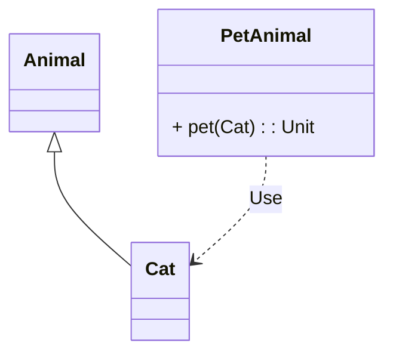
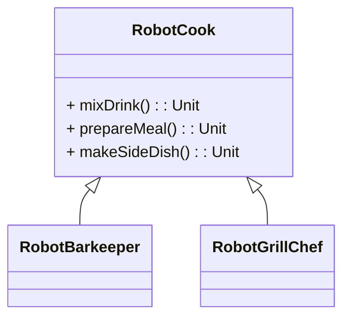

# Topic: SOLID
## Question 1: What does the Liskov Substitution Principle (LSP) state?
- [ ] Subclasses may not override methods of the parent class.
- [ ] A subclass may only have private attributes.
- [ ] A subclass must behave like its parent class in every context.
- [ ] Subclasses must have fewer methods than their parent classes.

## Question 2: What issue can a violation of the Liskov Substitution Principle (LSP) cause?
- [ ] Methods cannot be overloaded.
- [ ] Subclasses behave unexpectedly and break existing logic.
- [ ] New methods cannot be added.
- [ ] The code automatically becomes slower.

## Question 3: Why is it problematic if a class implements methods of an interface it doesn't need?
- [ ] The class automatically becomes larger.
- [ ] The class becomes unnecessarily dependent on methods it doesn't use.
- [ ] It leads to less reusability.
- [ ] The compiler ignores unused methods.

## Question 4: How can the Interface Segregation Principle (ISP) be correctly applied?
- [ ] By splitting a large interface into several specialized interfaces.
- [ ] By using a single interface for all classes.
- [ ] By requiring every class to implement all methods of an interface.
- [ ] By creating an interface with only one method.

## Question 5: What is the main goal of the Dependency Inversion Principle (DIP)?
- [ ] Low-level modules should control high-level modules.
- [ ] High-level modules should not directly depend on low-level modules.
- [ ] Low-level modules should not use abstractions.
- [ ] High-level modules should directly reference concrete implementations.

## Question 6: How can the Dependency Inversion Principle (DIP) be implemented?
- [ ] All classes should use concrete implementations as dependencies.
- [ ] High-level modules should directly depend on low-level modules.
- [ ] Define abstractions (interfaces) that both modules use.
- [ ] Low-level modules should control high-level modules.

## Question 7: What is an advantage of applying the Dependency Inversion Principle (DIP)?
- [ ] The code becomes shorter.
- [ ] Interfaces are no longer needed.
- [ ] The code becomes more flexible and easier to test.
- [ ] All methods must be directly implemented in the main class.

## Frage 8:
Which SOLID principle is violated here?

- [ ] Single Responsibility
- [ ] Dependency Inversion
- [ ] Interface Segregation
- [ ] Liskov Substitution

## Frage 9:
Which SOLID principle is violated here?

- [ ] Single Responsibility
- [ ] Dependency Inversion
- [ ] Interface Segregation
- [ ] Open-Closed